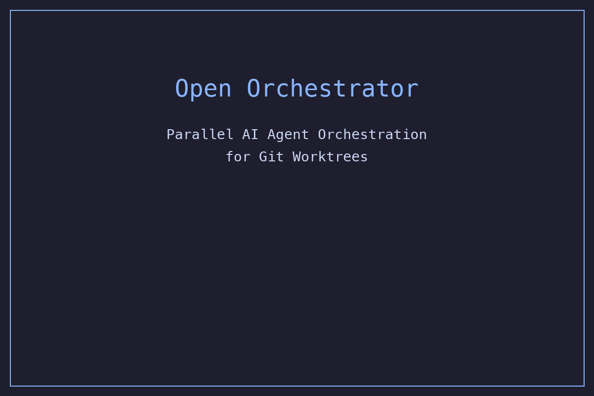

# Open Orchestrator

[](https://github.com/gitpcl/openorchestrator/actions/workflows/ci.yml) [](LICENSE)

A lean Git Worktree + AI agent orchestration tool for parallel development workflows. Coordinate multiple AI coding sessions across isolated branches with a Textual-based **switchboard UI**. Supports Claude Code, OpenCode, and Droid. Optional **Agno intelligence layer** adds AI-powered planning, quality gating, and merge conflict resolution. Optional **MCP peer communication** enables agent-to-agent messaging and coordination.

## Overview

Open Orchestrator enables developers to work on multiple tasks simultaneously by creating isolated worktrees, each with its own AI coding session and tmux session. Start with `owt new "task description"` — it auto-generates a branch name, creates the worktree, installs dependencies, copies `.env`, and starts the AI tool. Run `owt` to launch the **switchboard** — a card grid showing all active agents at a glance.



> **Agent Teams vs Open Orchestrator:** [Claude Code's Agent Teams](https://code.claude.com/docs/en/agent-teams) coordinate multiple AI agents within the *same codebase*. Open Orchestrator manages multiple *isolated worktrees* (different branches, different directories, independent environments). They're complementary — use Agent Teams for intra-branch collaboration, Open Orchestrator for cross-branch orchestration.

## Features

- **20 commands** — focused CLI surface, no bloat
- **Switchboard UI** — Textual-based card grid with status lights, diff stats, file overlap warnings, and detail panels
- **Conflict Guard** — real-time file overlap detection between parallel agents; warns before merge when two branches touch the same files
- **AI-Powered Planning** — `owt plan "Build auth system"` decomposes a goal into a dependency-aware DAG, spawns agents in parallel, auto-injects parent context into child tasks
- **Orchestrator Agent** — `owt orchestrate` drives a plan end-to-end into a feature branch with coordination, user presence detection, and stop/resume
- **Patchable automated sessions** — orchestrated and batch agents run in live tmux-backed provider sessions, receive their task automatically, stay patchable from the switchboard, and still export `OWT_AUTOMATED=1` so hooks can treat them as automation
- **MCP Peer Communication** — agents discover each other via `list_peers`, exchange messages via `send_message`/`check_messages`, and coordinate file edits via `get_peer_files` — all through native MCP tools backed by shared SQLite
- **Session init protocol** — agents receive a structured 6-step prompt (orient → explore → implement → test → verify → commit) based on Anthropic's harness design research, with project test/dev commands auto-injected
- **Retry + timeouts** — failed tasks retry once with failure context; 30-min default timeout prevents hung agents from blocking the DAG
- **Autopilot Loops** — `owt batch tasks.toml` runs Karpathy-style autonomous loops with DAG-aware scheduling
- **Agent Broadcast** — `owt send --all "Run tests"` fans out instructions to all active agents
- **Merge Queue** — `owt queue` shows optimal merge order; `owt queue --ship` ships all completed work intelligently
- **Context Bridge** — `owt note "msg"` shares context across all agent sessions via CLAUDE.md injection
- **Headless Mode** — `owt new "task" --headless` for CI/CD; `owt wait` polls until agent finishes
- **One-command setup** — `owt new "task"` does everything: branch → worktree → deps → .env → tmux → AI tool
- **Quality Gate** — `owt ship` optionally runs AI quality review before merging (with Agno); checks code quality, cross-worktree conflicts
- **AI Conflict Resolution** — merge conflicts can be resolved semantically by an AI agent before falling back to manual resolution
- **Ship in one shot** — `owt ship` auto-commits, merges to main, and tears down worktree + session
- **Two-phase merge** — `owt merge` catches conflicts early with file overlap warnings, then auto-cleans. Supports `--rebase` for linear history, `--strategy ours|theirs` for auto-resolution, and `--leave-conflicts` for manual resolution
- **Full teardown** — `owt delete` kills tmux session + removes worktree + cleans status
- **Live status detection** — switchboard detects when agents are waiting for input or blocked
- **AI tool auto-detection** — detects Claude, OpenCode, Droid with picker when multiple found
- **Project detection** — auto-detects Python, Node.js, Rust, Go, PHP and installs deps
- **7 dependencies** — click, pydantic, rich, textual, toml, gitpython, libtmux (+ optional agno for intelligence, mcp for peer communication)

## Installation

### Requirements

- Python 3.10+
- Git
- tmux
- An AI coding tool (Claude Code, OpenCode, or Droid)

### Install from PyPI

```bash
pip install open-orchestrator

# With Agno intelligence layer (AI-powered planning, quality gate, conflict resolution)
pip install open-orchestrator[agno]

# With MCP peer communication (agent-to-agent messaging)
pip install open-orchestrator[mcp]

# Both
pip install open-orchestrator[agno,mcp]
```

### Install from source

```bash
git clone https://github.com/gitpcl/openorchestrator.git
cd openorchestrator
uv pip install -e .

# With optional features
uv pip install -e ".[agno]"        # Intelligence layer
uv pip install -e ".[mcp]"         # Peer communication
uv pip install -e ".[agno,mcp]"    # Both
```

## Quick Start

```bash
# Launch the switchboard (persistent tmux session)
owt

# Create a worktree with AI agent (one command does everything)
owt new "Add user authentication with JWT"

# From inside an agent session, press Alt+s to return to the switchboard
# Or use CLI to interact:
owt send auth-jwt "Fix the failing tests"
owt switch auth-jwt    # Jump to that session

# Ship when done (commit + merge + delete in one shot)
owt ship auth-jwt
# Or press S from the switchboard
```

## Commands

| Command | Alias | Description |
|---------|-------|-------------|
| `owt` | | **Launch the Switchboard** — card grid with status lights |
| `owt new "task"` | `owt n` | Create worktree + tmux + deps + AI agent |
| `owt new "task" --headless` | | Create worktree without tmux (CI/script use) |
| `owt list` | `owt ls` | List worktrees with status |
| `owt switch <name>` | `owt s` | Jump to a worktree's tmux session |
| `owt send <name> "msg"` | | Send command to a worktree's AI agent |
| `owt send --all "msg"` | | Broadcast to ALL worktrees |
| `owt send --working "msg"` | | Broadcast to WORKING worktrees only |
| `owt merge <name>` | `owt m` | Two-phase merge + conflict guard + cleanup (`--rebase`, `--strategy`, `--leave-conflicts`) |
| `owt ship <name>` | | Commit + merge + delete in one shot |
| `owt delete <name>` | `owt rm` | Delete worktree + tmux + status |
| `owt queue` | | Show optimal merge order for completed worktrees |
| `owt queue --ship` | | Ship all completed worktrees in optimal order |
| `owt plan "goal"` | | AI-powered task decomposition into dependency DAG |
| `owt plan "goal" --start` | | Plan + start orchestrator in one shot |
| `owt batch tasks.toml` | | Autopilot: run batch tasks from TOML (DAG-aware) |
| `owt orchestrate plan.toml` | | Orchestrate plan into feature branch with coordination |
| `owt orchestrate --resume` | | Resume orchestrator from saved state |
| `owt orchestrate --stop` | | Graceful stop (worktrees kept) |
| `owt orchestrate --status` | | Show orchestrator progress |
| `owt wait <name>` | | Poll until agent finishes (for CI/scripts) |
| `owt note "msg"` | | Share context across all agent sessions |
| `owt sync [--all]` | | Sync with upstream |
| `owt cleanup [--force]` | | Remove stale worktrees |
| `owt version` | | Show version |

## The Switchboard

Run `owt` with no arguments to launch the switchboard — your command center. It runs in a persistent tmux session (`owt-switchboard`), so it stays alive when you patch into an agent session.

```
  SWITCHBOARD                          4 lines  ●3 active  ⚠1 waiting  !1 overlap

  ┌─ auth-jwt ──────────────┐   ┌─ fix-login ──────────────┐
  │ ● WORKING        12m    │   │ ○ IDLE              3h    │
  │ feat/auth-jwt           │   │ fix/login-redirect        │
  │ claude        +142 -37  │   │ claude                    │
  │ Implementing JWT auth   │   │ —                         │
  └─────────────────────────┘   └───────────────────────────┘

  ┌─ api-refactor ──────────┐   ┌─ db-migration ────────────┐
  │ ● WORKING        45m    │   │ ⚠ BLOCKED           5m    │
  │ refactor/api-v2         │   │ feat/db-migration         │
  │ opencode       +89 -12  │   │ claude          +23 -5    │
  │ [! 2 overlap]           │   │ Waiting for input         │
  └─────────────────────────┘   └───────────────────────────┘

  [arrows] nav [Enter] patch [s] send [a] all [n] new [S] ship [f] files [i] info [q] quit
```

**Status lights:** ● working, ○ idle, ⚠ blocked, ✓ done

**Switchboard keys:**
- **Arrow keys** — navigate between cards
- **Enter** — patch into that agent's tmux session (switchboard stays alive)
- **s** — send a message to the selected agent
- **a** — broadcast a message to ALL agents
- **n** — create a new worktree + agent
- **S** — ship the selected worktree (commit + merge + delete)
- **d** — delete the selected worktree (with confirmation)
- **m** — merge the selected worktree
- **f** — show file overlap detail for the selected card
- **i** — show detail panel (commits, diff stats, overlaps)
- **q** — quit back to terminal

**Global tmux keybindings (work from any agent session):**
- **Alt+s** — switch back to the switchboard
- **Alt+m** — merge current worktree
- **Alt+d** — delete current worktree
- **Alt+c** — create a new worktree (opens popup)

**Navigation flow:**

```
owt → switchboard → Enter → agent session → Alt+s → switchboard → q → terminal
```

## Workflow Templates

Three built-in templates for common workflows:

```bash
owt new "Add payments" --template feature   # Plan mode, TDD workflow
owt new "Fix crash" --template bugfix       # Root cause focus, minimal changes
owt new "Patch CVE" --template hotfix       # Emergency, production stability
```

## Agno Intelligence Layer (Optional)

Install with `pip install open-orchestrator[agno]` to enable AI-powered intelligence features. Without it, everything works exactly as before — all three features gracefully degrade.

### Intelligent Planner

`owt plan` uses an Agno agent with codebase awareness — it reads the file tree and git history to produce better task decompositions with Pydantic-validated structured output (no regex parsing). Falls back to subprocess-based planning if Agno is not installed.

### Quality Gate

`owt ship` runs an AI quality review before merging. Checks for:
- Code completeness (TODOs, partial implementations, debug code)
- Security issues (hardcoded secrets, injection vulnerabilities)
- Cross-worktree conflicts (files modified by other active agents)

If the quality gate flags issues, you're prompted to ship anyway or abort. Skipped with `--yes`.

### Merge Conflict Resolution

When `auto_resolve_conflicts = true` in config, merge conflicts are resolved semantically by an AI agent before falling back to manual resolution. Only applies resolved content when confidence exceeds 0.8.

### Cross-Worktree Coordination

The orchestrator detects file overlaps between running worktrees and injects context into each agent's CLAUDE.md. With Agno, a coordinator agent generates intelligent, targeted messages. Without Agno, template-based warnings are used. Coordination runs on a 120s cooldown per event to avoid noise.

### Agno Configuration

```toml
[agno]
enabled = true                           # Toggle intelligence features
model_id = "claude-sonnet-4-20250514"    # Default model (Claude, OpenAI, Gemini)
planner_model_id = "claude-sonnet-4-20250514"  # Override for planner
quality_gate_model_id = "claude-sonnet-4-20250514"  # Override for gate
coordinator_model_id = "claude-haiku-4-5-20251001"  # Cost-effective for coordination
quality_gate_threshold = 0.7             # Minimum score to pass (0.0-1.0)
auto_resolve_conflicts = false           # Auto-apply AI conflict resolutions
```

API keys use standard env vars (`ANTHROPIC_API_KEY`, `OPENAI_API_KEY`, etc.) — no OWT-specific config needed.

## MCP Peer Communication (Optional)

Install with `pip install open-orchestrator[mcp]` to enable agent-to-agent communication via MCP. Each agent's Claude Code session gets an MCP server providing peer discovery and messaging tools.

### How It Works

When `owt new` creates a worktree, an `owt-peers` MCP server config is injected into `.claude/settings.local.json`. Claude Code spawns the server process (stdio), which reads/writes to the shared SQLite database. No broker daemon needed — all coordination happens through the existing `status.db` with WAL mode.

```
Agent A (feat/auth)              Agent B (feat/api)
     |                                |
  Claude Code                     Claude Code
     |                                |
  MCP Server (stdio)             MCP Server (stdio)
     |                                |
     +-------> status.db <------------+
```

### Agent Tools

| Tool | Purpose |
|------|---------|
| `list_peers` | Discover active agents (name, branch, status, summary) |
| `send_message` | Send to a peer (`to_peer="*"` broadcasts) |
| `check_messages` | Read unread messages from peers |
| `set_summary` | Update visible status for coordination |
| `get_peer_files` | Check what files a peer is editing |

### Example Agent Conversation

```
Agent A (auth-jwt):
  list_peers() → [{name: "api-refactor", branch: "refactor/api-v2", status: "working"}]
  send_message("api-refactor", "I'm adding auth middleware to server.py — are you touching it?")

Agent B (api-refactor):
  check_messages() → [{from: "auth-jwt", message: "...are you touching it?"}]
  send_message("auth-jwt", "No, only routes.py and models.py. Go ahead.")
```

Gracefully degrades — if MCP SDK is not installed, worktrees are created without the peer server config. Claude Code handles missing MCP servers without errors.

## Configuration

Config files are loaded in priority order:
1. `.worktreerc` in current directory
2. `.worktreerc.toml`
3. `~/.config/open-orchestrator/config.toml`
4. `~/.worktreerc`

```toml
[worktree]
base_directory = "../"
auto_cleanup_days = 14

[tmux]
auto_start_ai = true
ai_tool = "claude"        # claude, opencode, droid
mouse_mode = true

[environment]
auto_install_deps = true
copy_env_file = true
```

### Environment Variables

| Variable | Set by | Purpose |
|----------|--------|---------|
| `OWT_AUTOMATED` | OWT (in orchestrated panes) | Lets user hooks distinguish automated agents from interactive sessions. Check `[ -n "$OWT_AUTOMATED" ]` in hooks to skip restrictions for agents. |
| `OWT_DB_PATH` | OWT hook/MCP wiring or user override | Points hooks, MCP peer servers, and in-process status tracking at the same SQLite DB. If `~/.open-orchestrator/status.db` is not writable, orchestrator/batch fall back to repo-local or temp-backed storage. |

## AI Tool Support

Open Orchestrator auto-detects installed AI tools and offers a picker when multiple are found:

| Tool | Binary | Notes |
|------|--------|-------|
| Claude Code | `claude` | Default, `--dangerously-skip-permissions`; orchestrated agents use `-p` with cat-piped prompts |
| OpenCode | `opencode` | Go-based |
| Droid | `droid` | `--skip-permissions-unsafe` by default |

```bash
owt new "task" --ai-tool claude --plan-mode
owt new "task" --ai-tool opencode
owt new "task" --ai-tool droid
```

## Project Detection

Automatically detects project type and installs dependencies:

| Type | Detection | Package Manager |
|------|-----------|----------------|
| Python | `pyproject.toml`, `uv.lock`, `requirements.txt` | uv > poetry > pipenv > pip |
| Node.js | `package.json`, `bun.lockb`, `pnpm-lock.yaml` | bun > pnpm > yarn > npm |
| Rust | `Cargo.toml` | cargo |
| Go | `go.mod` | go |
| PHP | `composer.json` | composer |

## Common Patterns

### Parallel Feature Development
```bash
owt new "Build Stripe integration"
owt new "Write payment tests"
owt new "Add payment docs"
# -> Three agents working in parallel, visible in switchboard
# -> Conflict Guard warns if agents touch the same files
```

### AI-Powered Planning (DAG Execution)
```bash
owt plan "Build JWT auth with refresh tokens and admin dashboard"
# -> AI decomposes into dependency-aware tasks, saves plan.toml

owt plan "Add auth" --start --branch feat/auth-v2
# -> Generate plan + orchestrate into feature branch

owt plan "Add rate limiting" --execute
# -> Generate plan + run in batch mode (ships to main)

owt plan "Fix auth bugs" --execute --auto-ship
# -> Generate plan + run + auto-merge completed tasks
```

Tasks with dependencies run in topological order. Independent tasks run in parallel. Parent task context (git log summaries) is auto-injected into child worktrees' CLAUDE.md.

### Orchestrator (Feature Branch Mode)
```bash
# Plan + start orchestration in one shot
owt plan "Add JWT auth" --start --branch feat/auth-v2

# Or plan first, orchestrate later
owt plan "Add JWT auth"                              # generates plan.toml
owt orchestrate plan.toml --branch feat/auth-v2      # starts orchestration

# Control the orchestrator
owt orchestrate --resume                              # resume from saved state
owt orchestrate --stop                                # graceful stop
owt orchestrate --status                              # show progress

# User jumps in to help (orchestrator pauses that worktree)
owt switch auth-models
# -> orchestrator detects user, skips auto-actions on auth-models
# -> user leaves → orchestrator resumes coordination

# When all tasks complete:
# "All 5 tasks merged into feat/auth-v2. Ready for review."
# User opens PR: feat/auth-v2 → main
```

The orchestrator merges completed tasks into a **feature branch** (not main), persists state for stop/resume, detects user presence to pause auto-actions, and coordinates agents when file overlaps are detected (Agno or template fallback). Orchestrated and batch agents now start as live provider sessions, receive the structured session-init prompt through tmux, and remain patchable from the switchboard while the shared runtime evaluator watches both hook updates and pane state to detect waiting, blocked, exited, and silent-failure cases. Safety nets: auto-commits uncommitted work, optional quality gate, empty-branch guard, retry with failure context, and per-task timeouts (30 min default).

### Overnight Autopilot (Batch Mode)
```toml
# tasks.toml — now supports dependency DAGs
[batch]
max_concurrent = 3
auto_ship = true
min_agent_runtime = 60

[[tasks]]
id = "models"
description = "Create User and Token models"
depends_on = []

[[tasks]]
id = "auth-api"
description = "Build auth endpoints"
depends_on = ["models"]

[[tasks]]
id = "auth-tests"
description = "Write auth integration tests"
depends_on = ["auth-api"]
```
```bash
owt batch tasks.toml --auto-ship
# -> Respects dependency order, injects parent context
# -> Auto-ships completed work, starts next task
```

### Broadcasting Instructions
```bash
owt send --all "Run tests and fix any failures"
owt send --working "Wrap up and commit your changes"
# Or press 'a' in the switchboard to broadcast
```

### Sharing Context Across Agents
```bash
owt note "The users table now has a verified_at column"
owt note "API endpoints moved from /api/v1 to /api/v2"
# -> Injected into each worktree's CLAUDE.md
```

### Smart Merge Order
```bash
owt queue              # Show optimal merge order
owt queue --ship       # Ship all completed worktrees, smallest first
owt queue --ship --yes # No confirmation
```

### Merge Strategies
```bash
owt merge auth-jwt                     # Standard merge + auto-cleanup
owt merge auth-jwt --rebase            # Rebase for linear history
owt merge auth-jwt --strategy theirs   # Auto-resolve conflicts (ours|theirs)
owt merge auth-jwt --leave-conflicts   # Keep merge in-progress for manual resolution
owt merge auth-jwt --keep              # Keep worktree after merging
```

### CI/CD Headless Mode
```bash
owt new "Run security audit" --headless
owt wait security-audit --timeout 1200
# -> Polls until agent finishes, exits 0 on success
```

### Bug Investigation + Fix
```bash
owt new "Profile memory usage in user service" --plan-mode
# -> Agent investigates in plan mode (read-only)
# Later: owt merge memory-profile
```

### Delegating Tasks
```bash
owt send auth-jwt "Now add refresh token support"
owt send api-refactor "Focus on the /users endpoint first"
```

## Development

```bash
uv pip install -e .
uv run pytest              # 698+ tests
uv run ruff check src/
uv run mypy src/
```

## Claude Code Integration

Use these slash commands in Claude Code sessions:

- `/wt-create` — Quick worktree creation
- `/wt-list` — List all worktrees
- `/wt-status` — Check AI activity
- `/wt-cleanup` — Clean stale worktrees

## Architecture

```
src/open_orchestrator/
├── cli.py                     # 20 CLI commands (click)
├── config.py                  # Hierarchical config (TOML) + AgnoConfig
├── core/
│   ├── switchboard.py         # Textual card grid UI (async polling, modal screens, broadcast)
│   ├── intelligence.py        # Agno intelligence layer (planner, quality gate, conflict resolver, coordinator)
│   ├── orchestrator.py        # Orchestrator agent (plan → execute → merge → feature branch)
│   ├── worktree.py            # Git worktree CRUD
│   ├── tmux_manager.py        # tmux session management
│   ├── merge.py               # Two-phase merge + merge queue + conflict guard + AI resolution
│   ├── batch.py               # Autopilot loop + DAG scheduler + AI planner (Agno or subprocess)
│   ├── environment.py         # Deps, .env, CLAUDE.md, shared notes injection
│   ├── status.py              # AI activity tracking (SQLite + WAL)
│   ├── hooks.py               # AI tool hook installer (status push + MCP config)
│   ├── mcp_peer.py            # MCP peer communication server (optional)
│   ├── cleanup.py             # Stale worktree removal
│   ├── sync.py                # Upstream sync
│   ├── branch_namer.py        # Task → branch name
│   ├── project_detector.py    # Auto-detect project type
│   ├── pane_actions.py        # Create/remove orchestration
│   ├── agent_detector.py      # Detect installed AI tools
│   └── theme.py               # Centralized color constants (Material Design 2)
├── models/
│   ├── intelligence.py        # Agno structured output models (TaskPlan, QualityVerdict, etc.)
│   ├── worktree_info.py       # Worktree models
│   ├── project_config.py      # Project config models
│   ├── maintenance.py         # Cleanup/sync models
│   └── status.py              # AI status models
├── popup/                     # tmux popup picker
├── skills/                    # Claude Code skill definition
└── utils/                     # Safe file I/O
```

## License

MIT
